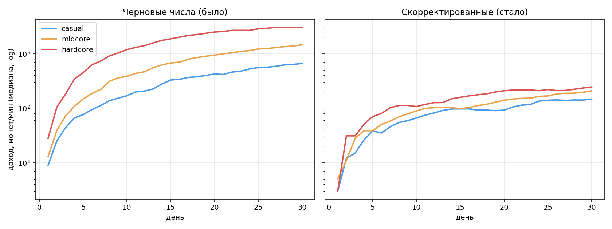
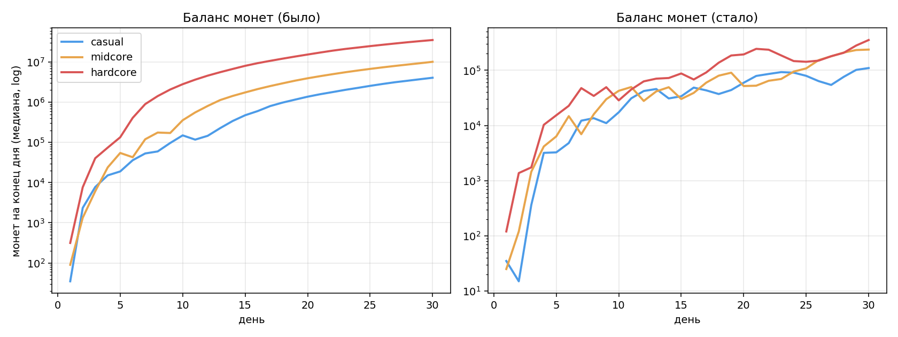
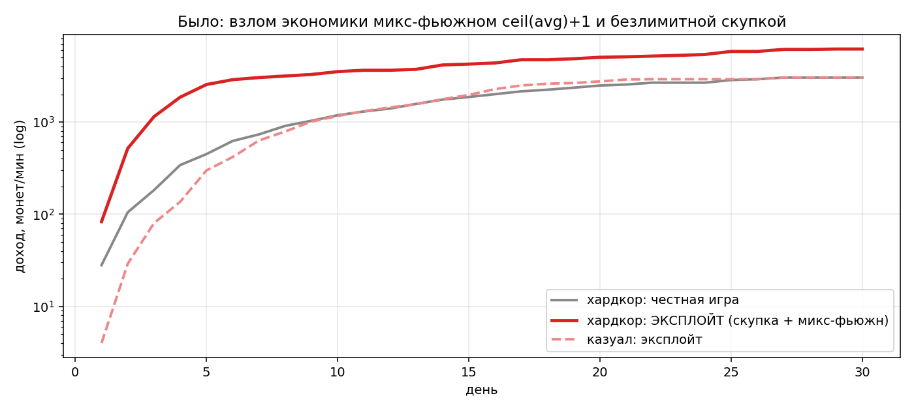
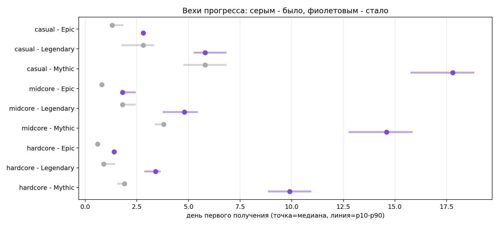

# 💰 Экономика Scare Park: модель, симуляция 30 дней, скорректированные числа

> Симулятор: [`sim/economy_sim.py`](./sim/economy_sim.py) · сырые данные: [`sim/out/daily.csv`](./sim/out/daily.csv), [`sim/out/results.json`](./sim/out/results.json) · перезапуск: `python3 sim/economy_sim.py --reps 80 --charts`
>
> Метод: Монте-Карло (80 повторов), день моделируется поминутно вокруг 5-минутных ротаций. Три архетипа: **казуал** 20 мин/день (2 сессии), **мидкор** 60 мин/день (2 сессии), **хардкор** 180 мин/день (3 сессии). Политика игрока — жадная (покупает/фьюзит как только может): это **потолок честной скорости**, живые игроки медленнее. Точность вех ±0,5 дня.

## 0. Что моделировалось и какие дыры пришлось закрыть

Механики взяты из кода (`ShopService`, `FusionService`, `IncomeService`, `PlotService`, `SecretConfig`), числа — из ТЗ/`GameConfig`. В коде и ТЗ отсутствуют — **приняты допущения**, они же вошли в предложение «стало»:

| Дыра | Допущение модели |
| --- | --- |
| Цены слотов аттракционов 4–10 (в коде слоты захардкожены = 3) | кривая 400 → 400 000 монет, см. §4 |
| Сток витрины (в коде позицию можно покупать бесконечно) | «нормальный» игрок берёт позицию 1 раз; эксплойтер — сколько влезет |
| Доход Nightmare/Secret (в каталоге монстров их нет, fallback в коде = 1/мин!) | 243/мин по 04-game-design |
| Доход только пассивный | монеты за испуги/волны не моделировались (в коде их нет) |

Расхождение в доках: `04-game-design.md` даёт доходы 1/3/9/27/81/243, каталог и ТЗ — 1/3/8/20/50. Моделировалась вторая ветка (она в коде).

---

## 1. Симуляция черновых чисел («было»)

День первого получения, медиана [p10–p90] по 80 прогонам:

| Веха | Казуал | Мидкор | Хардкор | Целевое ощущение |
| --- | --- | --- | --- | --- |
| Epic | **1.3** [1.3–1.8] | 0.8 | 0.6 | казуал: день 2–3 → **рано** |
| Legendary | 2.8 [1.8–3.3] | 1.8 | 0.9 | — |
| Mythic | **5.8** [4.8–6.8] | **3.8** [3.4–3.8] | 1.9 | мидкор: ≥ 3-я неделя → **в 4 раза раньше** |
| Nightmare | 14.3 | 7.8 | 3.9 | «виральный эндгейм» → обыденность 1-й недели |

Доход, монет/мин (медиана, конец дня): казуал 112 → 660, мидкор 220 → 1454, хардкор 734 → 3038 за 30 дней. Балансы к дню 30: **4,1 / 10,1 / 35,3 млн монет** при полностью выкупленных синках.




Выводы по вопросу «где встаёт, где взрывается»:

- **Прогресс нигде не встаёт** (стоп-метрика «до следующей значимой покупки > 2 дней» не сработала ни у одного архетипа ни в один день). Проблема черновика противоположная — **гиперинфляция**: после ~дня 8–14 покупать нечего, миллионы монет копятся мёртвым грузом. Причины: нет плат за фьюжн, нет поздних синков, офлайн платит до 16–24 ч/сутки (кап 8 ч применяется **к каждому окну отсутствия**, а окон 2–3 в день).
- Компрессия архетипов: казуал получает Mythic всего в 3 раза позже хардкора при 9-кратной разнице времени — потому что офлайн-доход (одинаковый у всех) доминирует над онлайн-игрой.
- Фьюжн дешевле магазина без компенсации временем: 4×Epic = 2400 < Legendary 3500; 256×Common = 6400 < Mythic 15000. С безлимитной скупкой Common это главный разгон.

---

## 2. 🚩 Красные флаги (эксплойты и баги, с ценой вопроса)

Отсортировано по тяжести. Цифры — из симуляции эксплойт-политики и разбора кода.

**1. Формула редкости фьюжна `ceil(avg)+1` ломает всю прогрессию.**
`FusionService.resultRarity` не требует 4 одинаковых: микс **1×Rare + 3×Common → Epic** (195 монет вместо 600), 1×Epic + 3×Rare → Legendary (555), 1×Legendary + 3×Epic → Mythic (**1140 монет** вместо 15 000), 1×Mythic + 3×Legendary → Nightmare (**2805 монет**), 1×Nightmare + 3×Mythic → Secret. Симуляция эксплойтера: **хардкор — Mythic в день 0.9, Nightmare в день 1.9; казуал — Mythic в день 3.3**. Доход эксплойтера к дню 30 — 6500/мин (×2,2 честного). Фикс: только 4 монстра одной редкости (§4, п.6).



**2. Магазин продаёт одну позицию бесконечно.**
В `ShopService.Buy` нет ни стока, ни лимита частоты — весь корм для п.1 покупается за минуты. Дополнительно: `Buy` можно спамить с клиента без кулдауна. Фикс: сток 1 на позицию + персональные дневные лимиты + серверный rate-limit.

**3. Секретный рецепт «АнтиМим» = Nightmare за 100 монет.**
4 Мима Молчуна (Common, 25 монет) → Nightmare-босс с таймером 2 ч. Мим появляется в ~15 % позиций витрины — 4 штуки собираются за ~30 минут игры. Рецепт утечёт в Discord/TikTok в день релиза → у половины сервера Nightmare в день 1. Бонус-баг: боссов нет в `MonsterCatalog`, поэтому их доход = fallback **1 монета/мин** — Nightmare хуже Common. Фикс: ингредиенты секретных рецептов — только Epic+; результат — уникальный босс с доходом уровня Legendary–Mythic; каталог боссов на сервере.

**4. Floor на тике дохода: новичок зарабатывает 0.**
`IncomeService` начисляет `floor(rate × 10/60)` каждые 10 с. При ставке < 6 монет/мин (например, 3 Common на старте = 3/мин) онлайн-доход равен **нулю** — сломанный онбординг первых минут. Фикс: копить дробный остаток в профиле и начислять целую часть.

**5. Офлайн-кап 8 ч действует на каждое окно отсутствия.**
2–3 захода в день = 16–24 ч оплаченного офлайна. Это уравнивает казуала с хардкором (см. §1) и кормит инфляцию. Фикс: суточный кап 8 ч (поле `offlinePaidToday`, сброс по UTC-дню). Важно: это НЕ наказание за пропуск — пропущенный день всё равно приносит 8 ч × 50 %.

**6. Витрина предсказуема навсегда.**
Сид = `floor(os.time()/300)`, генератор детерминирован → комьюнити построит сайт-предсказатель ротаций на месяцы вперёд (как для Grow a Garden). Для C/R это даже маркетинг («в 18:35 будет Legendary!»), но Mythic-обладателей это плодит по расписанию. Фикс: Mythic из витрины убрать (он и так убран в §4), в сид добавить серверную соль, если предсказуемость не нужна как фича.

**7. Rainbow ×10 сильнее всей прогрессии.**
Common×10 = 10/мин за 25 монет — лучше Epic (8/мин за 600). Mythic×10 = 500/мин = весь парк честного игрока. 0,5 % шанс на каждом фьюжне = у активного игрока раз в ~3 дня лотерейный джекпот, ломающий кривую (p90 в симуляции разъезжается на дни). Фикс: потолок ×6 (§4, п.9).

**8. Pay-to-win вопреки ограничению «только время и косметика».**
`ExtraAttractionSlot` gamepass 249 R$ — прямая сила (слот = доход навсегда). Оффер «Первый Испуг» ×2 доход на 24 ч — сила за деньги. Скип фьюжна без дневного лимита в «было» даёт киту ×1,5–2 темпа (см. §3). Фиксы: слоты только за монеты; оффер = скин + 3 жетона ускорения; дневной лимит платных ускорений.

**9. Фарм очков страха и смелости альтами (для этапа 2/3).**
Очки страха и смелость начисляются за живых посетителей → пара альт-аккаунтов = бесконечный ранг и смелость. Фиксы заранее: кап очков с одного уникального userId в день (например, 3 испуга), diminishing на повторные визиты, смелость — кап 10 парков/день, смелость не конвертируется в монет/монстров (только косметика/декор), иначе альт-фарм станет экономическим.

**10. Мутации у купленных монстров.**
Сейчас мутации только из фьюжна (в `ShopService.Buy` всегда `mutation = nil`) — это правильно и должно остаться осознанным решением: мутации в магазине сделали бы витринный снайпинг (п.6) кратно хуже.

---

## 3. Robux: сколько стоит время и не покупается ли сила

Скип фьюжна ~1 R$/3 мин. Сценарий «макс-кит»: скипает **каждый** таймер мгновенно (верхняя граница преимущества; фьюжн-цепочки крутятся без ожидания).

**«Было»:** таймеры — единственный тормоз, поэтому кит покупает темп:

| | Mythic f2p → кит | Nightmare f2p → кит | Ускорение темпа | Затраты кита за 30 дней |
| --- | --- | --- | --- | --- |
| Мидкор | 3.8 → 2.4 | 7.8 → 5.1 | **+35–37 %** | ~3 100 R$ |
| Хардкор | 1.9 → 0.9 | 3.9 → 2.4 | **+38–53 %** | ~8 800 R$ (1565 фьюжнов!) |

Это pay-to-win: цель «≤ ~20 % темпа» нарушена в 2 раза.

**«Стало»:** гейты перенесены на снабжение (сток, дневные лимиты) и монетные платы, таймеры дают комфорт, а не темп:

| | Mythic f2p → кит | Выигрыш | Nightmare f2p → кит | Выигрыш | Затраты кита |
| --- | --- | --- | --- | --- | --- |
| Казуал | 17.8 → 14.8 | **−17 %** | — | — | ~3 500 R$ |
| Мидкор | 14.6 → 12.4 | **−15 %** | 29.8 → 26.8 | −10 % | ~4 600 R$ |
| Хардкор | 9.9 → 8.4 | **−15 %** | 23.9 → 19.5 | **−18 %** | ~5 600 R$ |

Все вехи ≤ 20 % ✅. Обратная цена: день опережения стоит киту ~1 500–2 000 R$ — «догнать временем» тривиально (2–3 дня обычной игры), доминирующая ценность покупки — снять раздражение ожидания, не сила. Рекомендуемая страховка: дневной лимит платных ускорений (5/день) — против компульсивных трат детской аудитории; на медианный темп он не влияет вовсе.

Пример честной цены разового скипа в «стало»: Epic 2 ч = 40 R$, Legendary 6 ч = 120 R$ — дорого для полного скипа, поэтому продавать пресеты «−30 мин / −2 ч» (10/40 R$) и давать жетоны в сезонном пассе.

---

## 4. Скорректированная таблица чисел («было → стало»)

| # | Параметр | Было | Стало | Обоснование |
| --- | --- | --- | --- | --- |
| 1 | Цены магазина C/R/E/L/M | 25/120/600/3500/15000 | 25/**140**/**700**/**4500**/**—** | Mythic — только фьюжн (контроль пейсинга + анти-снайпинг витрины). R/E/L чуть дороже: фьюжн-путь остаётся выгоднее прямой покупки на ~10–20 % с учётом платы, но платит временем |
| 2 | Веса ротации C/R/E/L/M | 100/35/10/2/0.4 | 100/**18**/**0.6**/**0.2**/**0** | Epic-оффер: казуал видит ~1 раз в 5 дней, мидкор ~2 раза в 3 дня — праздник, а не конвейер. Именно частота E/L-офферов двигала мидкорский Mythic с дня 15 на день 9 |
| 3 | Сток позиции витрины | ∞ (бага) | **1 покупка** | закрывает скупку (флаг №2) |
| 4 | Дневной лимит покупок C/R/E/L | нет | **12/5/1/1** | главный гейт снабжения: уравнивает эксплойтера с честным, задаёт пейсинг пирамиды фьюжна (Mythic = 4L = 16E = 64R) |
| 5 | Доход, монет/мин C/R/E/L/M/N/S | 1/3/8/20/50, N/S нет (fallback 1!) | 1/3/8/20/50/**130**/**320** | базовая кривая здоровая — не трогаем; N/S добавить в серверный каталог, починить fallback |
| 6 | Формула фьюжна | ceil(avg)+1, любые 4 | **4 одной редкости → +1** | закрывает микс-эксплойт (флаг №1): Mythic за 1140 монет исчезает |
| 7 | Таймеры фьюжна (по результату) | R/E 10 м, L/M 30 м, N 2 ч | R **5 м** / E **2 ч** / L **6 ч** / M **8 ч** / N **8 ч** | R-фьюжн остаётся «вкусом» внутри сессии (короткая петля); E/L/M занимают ночной/дневной слот машины — реальный темп задают логины, а не таймер. Потолок 8 ч из 04-game-design соблюдён |
| 8 | Плата за фьюжн (монеты) | 0 | R **15** / E **250** / L **7 500** / M **90 000** / N **150 000** | двойная роль: (а) монетный гейт, который расслаивает архетипы (казуал копит на Mythic-фьюжн ~4 дня, хардкор ~1.5), (б) главный анти-инфляционный синк: за месяц сжигает 240k/353k/716k у казуала/мидкора/хардкора |
| 9 | Мутации (шанс не меняется: 10/4/1.5/0.5 %) | ×1.5/×3/×6/×10 | ×1.5/×2.5/×4/**×6** | убирает лотерейные джекпоты (флаг №7); EV дохода 1.25 → 1.18. Мутации — только из фьюжна (как в коде) |
| 10 | Слоты аттракционов 4–10 | в коде нет; gamepass 249 R$ | **400 / 1 500 / 6 000 / 25 000 / 75 000 / 150 000 / 400 000 монет**, gamepass-слот удалить | ранние слоты — цели первых сессий, поздние — недельные цели и синк; слот за R$ = pay-to-win (флаг №8) |
| 11 | Офлайн-доход | 50 %, кап 8 ч **на окно** | 50 %, кап 8 ч **в сутки** | флаг №5; сохраняет «не наказывать за пропуск»: пропущенный день = 240 эквивалент-минут дохода начислится при возврате |
| 12 | Старт | 50 монет + 1 Common бесплатно | без изменений | онбординг из 04-game-design работает: первая покупка в первые 2 минуты |
| 13 | Секретные рецепты | 4 Мима → Nightmare (100 монет) | ингредиенты **Epic+**, результат ≤ Mythic-уровня дохода | флаг №3 |
| 14 | Скип фьюжна | 1 R$/3 мин, без лимита | цена та же + **лимит 5 платных скипов/день**, пресеты 10/40 R$ | §3; страховка для аудитории 9–16 |
| 15 | Оффер «Первый Испуг» 5 R$ | ×2 доход 24 ч + скин + скип | **скин + 3 жетона ускорения + рамка** | сила за деньги нарушает «только время и косметика» |
| 16 | Тик дохода | floor на каждом тике | копить дробный остаток | флаг №4 |

Готовый фрагмент для `GameConfig.luau` / `ShopService.luau`:

```lua
-- Магазин
PRICE_BY_RARITY = { Common = 25, Rare = 140, Epic = 700, Legendary = 4500 } -- Mythic не продаётся
WEIGHT_BY_RARITY = { Common = 100, Rare = 18, Epic = 0.6, Legendary = 0.2 }
SHOP_STOCK_PER_SLOT = 1
DAILY_BUY_CAP = { Common = 12, Rare = 5, Epic = 1, Legendary = 1 }
-- Фьюжн: только 4 одинаковых редкости
FUSION_TIMERS = { Rare = 5*60, Epic = 2*3600, Legendary = 6*3600, Mythic = 8*3600, Nightmare = 8*3600 }
FUSION_FEES   = { Rare = 15, Epic = 250, Legendary = 7500, Mythic = 90000, Nightmare = 150000 }
MUTATIONS = { Neon = 1.5, Shadow = 2.5, BloodMoon = 4, Rainbow = 6 } -- шансы прежние (сервер)
-- Участок
SLOT_COSTS = { 400, 1500, 6000, 25000, 75000, 150000, 400000 } -- слоты 4..10
-- Доход (добавить в каталог)
INCOME.Nightmare, INCOME.Secret = 130, 320
-- Офлайн
OFFLINE_DAILY_CAP_HOURS = 8 -- суммарно за календарные сутки
```

---

## 5. Симуляция «стало»: проверка целей

| Веха | Казуал (20 м/д) | Мидкор (60 м/д) | Хардкор (180 м/д) |
| --- | --- | --- | --- |
| Epic | **2.8** [2.8–2.8] ✅ цель 2–3 дня | 1.8 [1.8–2.4] | 1.4 |
| Legendary | 5.8 [5.3–6.8] | 4.8 [3.8–5.4] | 3.4 [2.9–3.6] |
| Mythic | 17.8 [15.8–18.8] | **14.6** [12.8–15.8] → 15-е сутки ✅ | 9.9 [8.9–10.9] |
| Nightmare | за горизонтом сезона | день ~30 (1 % игроков) | 23.9 [20.4–26.9] ✅ |



- **Стопов нет:** медианное «время до следующей значимой покупки» ≤ 2 дней все 30 дней у всех архетипов (слоты → платы за фьюжн → следующий тир образуют непрерывную лестницу целей).
- **Инфляция погашена:** балансы к дню 30 — 110k/237k/353k ≈ 1–1,5 дневного дохода (против миллионов в «было»); платы за фьюжн сожгли 0,24–0,72 млн за месяц. Доход/мин к дню 30: 146/208/244 — кривые выполаживаются (правая панель графика §1).
- **Расслоение архетипов:** хардкор опережает мидкора на ~33 %, мидкора от казуала отделяют ~3 дня на Mythic — время решает, но не унижает казуала.
- **Эксплойт-политика в «стало» = честной** (Mythic день 9.9 у обеих на хардкоре): сток и лимиты нейтрализуют скупку полностью.
- Nightmare: хардкорный виральный момент конца месяца (день ~24), мидкор доберётся в начале 2-го сезона, казуал — цель сезона 2–3. Секретные рецепты дадут короткий путь избранным (по дизайну).
- Пропуск дня: игрок теряет только онлайн-часть и лимиты дня, офлайн 8 ч начисляется при возврате; стриков и сгораний нет — ограничение «не наказывать» соблюдено. Ежедневные лимиты покупок «догнать» нельзя, и это осознанно: они и есть пейсинг (как энергия в мобилках, но без стены — играть можно сколько угодно).

## 6. Что осталось за рамками модели (и что сделать дальше)

1. **Очки страха / сезонный ранг / смелость** не симулировались — в коде нет частоты посетителей. Рамки для v1: 8 тиров × 3 ступени (250–1000 очков/ступень) = 11 250 очков за 28-дневный сезон ≈ 400 очков/день у мидкора; кап очков с одного живого посетителя 3 испуга/день; смелость 10–25 за прохождение, кап 10 парков/день, тратится только на косметику/декор. После прототипа волн — отдельная симуляция.
2. **Доход за испуги/волны**: если добавите монеты за испуги (04-game-design это подразумевает), кривые §5 сдвинутся — пересимулировать с новым источником.
3. **Щедрость первой недели** (+20–30 % дохода новичкам из 04-доков) в модель не включена — при включении вехи казуала сместятся на ~0,5–1 день раньше, цели не ломает.
4. **Апгрейды машины фьюжна / вторая машина** — кандидаты на поздние синки (25k/75k монет), если телеметрия покажет застой хардкора после дня 20.
5. Модель — потолок скорости (жадный бот без ошибок): живые медианы будут на 20–40 % медленнее, лимиты и цели заданы с этим запасом.
